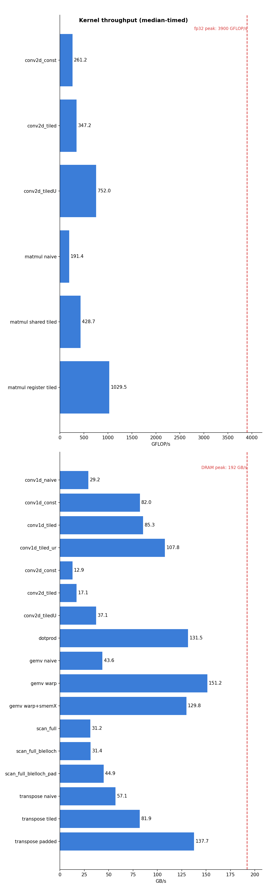

# CUDA Kernels

A collection of optimized CUDA kernel implementations for numerical operations, with correctness tests and benchmarks.

## Kernels

- **Matrix Multiplication** (`src/linalg/matmul_*.cu`)
  - Naive implementation
  - Shared-memory tiled implementation
  - Register-tiled implementation (2x2 outputs per thread)
- **Dot Product** (`src/linalg/dotprod.cu`)
  - Grid-stride loads, warp-shuffle reduction, block reduction, atomic finish
- **Matrix Transpose** (`src/linalg/transpose.cu`)
  - Naive (strided writes)
  - Shared-memory tiled (coalesced both ways, bank-conflicted)
  - Padded tile (`[TILE][TILE+1]`, conflict-free)
- **GEMV** — matrix-vector multiply (`src/linalg/gemv.cu`)
  - Naive (thread-per-row, uncoalesced)
  - Warp-per-row (coalesced loads + warp-shuffle reduction)
  - Warp-per-row with `x` staged in shared memory (a measured negative result — see Performance Notes)
- **Prefix Sum / Scan** (`src/scan/scan.cu`)
  - Single-block Hillis-Steele (inclusive, O(n log n) work)
  - Single-block Blelloch (exclusive, work-efficient O(n) up/down-sweep)
  - Multi-block 3-pass scan (scan chunks → scan block totals → add offsets), with three pass-1 variants: Hillis-Steele, Blelloch, and Blelloch with conflict-free padded indexing
- **1D Convolution** — stencil (`src/stencil/conv.cu`)
  - Naive (one thread per output, mask + input from global memory)
  - Constant-memory mask (`__constant__`, warp-broadcast constant cache)
  - Shared-memory tiled (input staged with halo, zero padding baked into the tile)
  - Tiled + compile-time radius (`template <int R>`, fully unrolled tap loop)
- **2D Convolution** — stencil (`src/stencil/conv.cu`)
  - Constant-memory mask, one thread per pixel, `__restrict__` read-only loads
  - Shared-memory tiled (32x8 blocks, halo ring, flatten-and-stride load, zero padding baked into the tile)
  - Tiled + compile-time radius (`template <int R>`, all (2R+1)² taps unrolled flat)

Interactive visualizations (download and open in a browser):

- [docs/register_tiled_matmul_viz.html](docs/register_tiled_matmul_viz.html) — step-through of the register-tiled matmul kernel (cooperative tile loads, barriers, per-thread 2x2 accumulation)
- [docs/bank_conflict_viz.html](docs/bank_conflict_viz.html) — shared-memory bank conflicts and why the +1 padding fixes them (animated bank queues, unpadded vs padded side by side)
- [docs/memory_hierarchy_occupancy_viz.html](docs/memory_hierarchy_occupancy_viz.html) — the GPU memory hierarchy (DRAM / L2 / L1 / shared / registers) plus an interactive occupancy calculator; steps through why manually caching data that already fits in L2 makes a kernel slower
- [docs/blelloch_scan_tree_viz.html](docs/blelloch_scan_tree_viz.html) — step-through of the Blelloch work-efficient scan: the implicit reduction tree overlaid on the array, up-sweep, root clear, and down-sweep, with the `ai`/`bi` index math shown live
- [docs/conv2d_halo_tiling_viz.html](docs/conv2d_halo_tiling_viz.html) — 2D convolution halo tiling: click a block, step the flatten-and-stride load passes (with zero padding at image edges), hover threads to see their compute windows, and toggle the classic wrong-stride bug to see what it actually reads

## Requirements

- **CUDA Toolkit** (v12.0+) — https://developer.nvidia.com/cuda-downloads
- **MSVC** (Windows, Visual Studio 2022 Build Tools) or **GCC** (Linux)
- **CMake** (v3.18+)

## Building

```powershell
cmake -S . -B build
cmake --build build --config Release
```

The GPU architecture defaults to `61` (GTX 1000 series). For a different GPU, pass it at configure time:

```powershell
cmake -S . -B build -DCMAKE_CUDA_ARCHITECTURES=86   # RTX 3000s
# 61 = GTX 1000s, 75 = RTX 2000s, 86 = RTX 3000s, 89 = RTX 4000s
# CMake 3.24+: -DCMAKE_CUDA_ARCHITECTURES=native to auto-detect
```

## Testing

Each test verifies the kernels against a CPU reference, then benchmarks them (median-of-samples timing, reporting GB/s for memory-bound kernels and GFLOP/s for compute-bound ones).

```powershell
ctest --test-dir build -C Release --verbose

# Or run directly
./build/Release/test_matmul.exe
./build/Release/test_dotprod.exe
```

## Visualizing Performance

`scripts/plot_perf.py` runs the test binaries, parses their benchmark output, and renders bar charts (one for compute-bound kernels in GFLOP/s, one for memory-bound kernels in GB/s). Requires Python 3.9+ with matplotlib.

```powershell
python scripts/plot_perf.py --peak-bw 192 --peak-flops 3900   # writes perf.png
```

`--peak-bw` / `--peak-flops` are your GPU's spec-sheet ceilings and draw the hardware limit on each chart; omit them if you just want the bars. New kernels show up automatically as long as their test prints through `reportPerf` in `tests/test_utils.h`.

## Adding a New Kernel

1. Add `include/<domain>/<kernel>.h` declaring the launch function(s).
2. Add `src/<domain>/<kernel>.cu` and list it in the `add_library` block in `CMakeLists.txt`.
3. Add `tests/test_<kernel>.cu` (use the helpers in `tests/test_utils.h`) and register it with one line: `add_kernel_test(test_<kernel>)`.

## Project Structure

```
├── include/
│   ├── core/
│   │   └── cuda_utils.h         # CUDA_CHECK error handling
│   ├── linalg/
│   │   ├── matmul.h
│   │   ├── dotprod.h
│   │   ├── transpose.h
│   │   └── gemv.h
│   ├── scan/
│   │   └── scan.h
│   └── stencil/
│       └── conv.h
├── src/
│   ├── linalg/
│   │   ├── matmul_naive.cu
│   │   ├── matmul_tiled.cu      # shared-memory tiled + register tiled
│   │   ├── dotprod.cu
│   │   ├── transpose.cu         # naive + tiled + padded
│   │   └── gemv.cu              # naive + warp-per-row + shared-x
│   ├── scan/
│   │   └── scan.cu              # Hillis-Steele + Blelloch + 3-pass multi-block
│   └── stencil/
│       └── conv.cu              # 1D + 2D: naive/const/tiled/unrolled variants
├── tests/
│   ├── test_utils.h             # shared correctness + benchmark helpers
│   ├── test_matmul.cu
│   ├── test_dotprod.cu
│   ├── test_transpose.cu
│   ├── test_gemv.cu
│   ├── test_scan.cu
│   ├── test_conv1d.cu           # correctness + perf + --sweep radius diagnostics
│   └── test_conv2d.cu
├── scripts/
│   └── plot_perf.py             # benchmark visualization (matplotlib)
├── docs/
│   ├── perf.png                 # benchmark chart (generated)
│   ├── register_tiled_matmul_viz.html   # interactive kernel walkthrough
│   ├── bank_conflict_viz.html           # bank conflicts + padding fix
│   ├── memory_hierarchy_occupancy_viz.html  # memory hierarchy + occupancy calculator
│   ├── blelloch_scan_tree_viz.html      # Blelloch scan tree walkthrough
│   └── conv2d_halo_tiling_viz.html      # 2D conv halo tiling + load passes
└── CMakeLists.txt
```

## Performance Notes (measured)



GTX 1060 Max-Q, sm_61, ~192 GB/s peak DRAM bandwidth. Laptop part: clocks drift with thermals, so timings use the median of several samples. To regenerate the chart above after a benchmark run: `python scripts/plot_perf.py --peak-bw 192 --peak-flops 3900 --out docs/perf.png`.

- **Dot product** (N = 16.7M floats): ~130–138 GB/s effective bandwidth (~70% of spec peak). The kernel is memory-bound; the reduction itself (warp shuffles + one `__syncthreads()`) is not the bottleneck.
  - `float4` vectorized loads **regressed ~5%** — coalesced scalar loads already saturate transaction width on Pascal, and the wider loads reduced loads-in-flight.
  - 4x loop unrolling was **neutral** (within run-to-run noise).
  - Conclusion: the scalar grid-stride kernel is kept as canonical; remaining gap to peak is the practical DRAM ceiling plus thermal throttling, not kernel code.
- **Transpose** (2048 x 4096): naive ~56 GB/s → tiled ~82 GB/s → padded ~139 GB/s (~72% of peak).
  - Tiled fixes global-write coalescing by staging the swap through shared memory; the gain is capped by a 32-way bank conflict on the transposed shared read.
  - Padding the tile to `[TILE][TILE+1]` removes the conflict (stride 33 is coprime with the 32 banks) and nearly doubles tiled throughput — the bank-conflict cost, isolated and measured.
- **GEMV** (4096 x 4096): naive ~31–39 GB/s → warp-per-row ~151 GB/s (~79% of peak) → warp + shared-`x` ~120–130 GB/s.
  - Thread-per-row makes a warp's 32 threads load addresses a full row apart (stride-N, uncoalesced: ~32 transactions where 1 would do). Warp-per-row flips the mapping — a warp owns one row and its 32 lanes read 32 consecutive floats per step, one coalesced transaction — then a warp-shuffle reduction collapses the partials. The ~31 → ~151 GB/s jump is the cost of coalescing, isolated and measured.
  - Staging `x` in shared memory **regressed ~15–20%**, for two stacked reasons:
    1. **L2 already had it.** `x` is 16 KB and re-read by all 4096 rows, so after the first touch it lives permanently in the 1.5 MB chip-wide L2 — the staging loop's global reads hit L2 anyway, saving zero DRAM traffic while adding 4096 loads + 4096 shared stores + a `__syncthreads()` to every block.
    2. **Occupancy collapse.** The 16 KB/block dynamic shared allocation lets only ⌊96 KB / 16 KB⌋ = 6 blocks fit per SM, versus the 16 the thread budget (2048/128) allows: 24 resident warps instead of 64 (100% → 37.5% occupancy), so the SM has far fewer warps to switch to while `A`'s loads stall.
  - Takeaway: shared memory is a *manually managed* scratchpad rented from the SM's 96 KB budget, not a free cache. Spend it only to save traffic the caches can't absorb (matmul tiles, convolution halos) — never to duplicate a small read-only vector that already fits in L2. See [docs/memory_hierarchy_occupancy_viz.html](docs/memory_hierarchy_occupancy_viz.html) for the interactive walkthrough.
- **Prefix sum / scan** (N = 1M floats, 3-pass multi-block, inclusive): Hillis-Steele pass 1 ~20–31 GB/s → Blelloch pass 1 ~21–31 GB/s → Blelloch + padded indexing ~30–45 GB/s end-to-end (absolute numbers swing ~50% with laptop clock state; the padded variant is consistently ~1.45–1.5× the baseline in same-run A/B, which is the number to trust).
  - Scan is the first kernel here that is *not* embarrassingly parallel: `out[i]` depends on all elements before it, so blocks coordinate through three launches (scan each 1024-chunk → exclusive-scan the block totals → broadcast offsets back). Kernel boundaries are the only cheap grid-wide sync.
  - nvprof: pass 1 is ~80% of runtime, and it runs at ~26 GB/s while the pass-3 streaming kernel (`out[i] += offset`, no barriers) hits ~117 GB/s on the same data volume — pass 1 is **barrier/shared-memory-bound, not DRAM-bound**.
  - Swapping the work-efficient Blelloch scan (O(n) adds vs O(n log n)) into pass 1 bought only **1.07×**: both algorithms hit ~20 `__syncthreads()` barriers per block, and barriers — not arithmetic — dominate. Big-O said huge; the wall clock said 7%.
  - Padding the shared indices (`i → i + (i>>5)`, one pad word per 32) removed the up-to-32-way bank conflicts of Blelloch's `2^d` strides and bought **1.7×** on pass 1 (311 → 182 µs) — ten times more than work-efficiency. Same coprime-stride principle as the transpose `[TILE][TILE+1]` pad, in 1-D form.
  - Known headroom (left on the table deliberately): the `(2*tid, 2*tid+1)` global load layout is stride-2 (imperfectly coalesced; the `tid`/`tid+n/2` layout fixes it), and pass 3 is a whole extra read-modify-write sweep that a fused or single-pass (decoupled-lookback) design would eliminate. See [docs/blelloch_scan_tree_viz.html](docs/blelloch_scan_tree_viz.html) for the tree walkthrough.
- **1D Convolution** (N = 16.7M floats, 9-tap mask, zero-padded): naive ~29 GB/s → constant-memory mask ~72–82 GB/s → shared-tiled ~77–87 GB/s → tiled + unrolled ~104–112 GB/s effective bandwidth — which is the streaming floor (read n, write n at the rate the card actually sustains), i.e. fully memory-bound with the arithmetic hidden. "Effective" counts ideal traffic (8 bytes/output); the mask and halo re-reads are precisely what the kernel must keep out of DRAM.
  - Constant memory beat global-memory mask reads **2.8×** — not because the 36-byte mask was far away (it sat in L2 either way), but because the warp-uniform `c_mask1d[j+r]` read broadcasts from the per-SM constant cache and folds into the FMA as an operand: 9 of 18 load instructions and 9 L2 round-trips removed from a 9-deep dependency chain.
  - A radius sweep (r = 1, 2, 4, 8; `test_conv1d --sweep`) decomposed every variant's time into a shared **~1.15–1.2 ms floor** (moving 128 MB at ~110–120 GB/s) plus a **per-tap price set by where the tap's operands live**: ~0.45 ms/tap for two L2 trips (naive), ~0.10 for one L2 trip (const), ~0.04 for shared memory (tiled).
  - Tiling has a fixed cost (tile load + `__syncthreads()`), so it only wins once the mask amortizes it: const wins at r ≤ 2, tiled from r = 4, 1.47× at r = 8. The gemv shared-x lesson sharpened into a rule: shared memory is a purchase, paid for by reuse × per-access saving.
  - A runtime-radius loop cannot unroll; `template <int R>` + `#pragma unroll` deleted the per-tap loop bookkeeping and let all 2R+1 shared-memory loads issue together — **1.4×** over the generic tiled kernel, landing on the memory floor with time essentially flat from 3 to 9 taps (1.16 → 1.20 ms). Common radii are dispatched via a `switch`; other radii fall back to the generic kernel.
- **2D Convolution** (4096 x 4096, 9x9 mask = 81 taps, zero-padded): const-mask 15.0 ms → + `__restrict__` 10.6 ms → shared-tiled 8.4 ms → tiled + unrolled **3.89 ms** (34.5 GB/s effective / 698 GFLOP/s). At r = 4 the arithmetic intensity (162 flops / 8 ideal bytes ≈ 20 flop/B) sits exactly on this card's roofline ridge (3900/192), so both GB/s and GFLOP/s are reported. Each step removed a different wall, and each wall was only visible after the previous one fell:
  1. **`__restrict__` → 1.4×.** On sm_61 plain global loads bypass the per-SM L1/tex cache entirely (L2 every time); since `in`/`out` could alias, the compiler may not use the read-only (`LDG.CI`) path. With ~5.4 GB of L2 traffic over 14.8 ms the kernel was saturating L2 bandwidth (~370 GB/s) while DRAM idled at 9 GB/s. Two `__restrict__` qualifiers rerouted all 81 taps through the L1/tex path.
  2. **Halo tile → 1.3×.** SASS showed the const kernel spending ~10 instructions per tap, only 1 of them the FMA — the zero-padding bounds check alone was ~4 (predicated, so no divergence cost; the price is issue slots, paid by the 98% of warps that never touch an edge). Staging a (TILE+2r)-sided tile in shared memory with the zeros baked in at load time deleted the per-tap checks. Global reads drop from 81 to 2.25 per pixel.
  3. **`template <int R>` → 2.2×.** With runtime r the compiler's 16-wide unrolled fast path is dead code at K = 9 taps/row (it requires >12), so every row ran remainder loops with per-row address setup — and each tap needed a separate indexed constant-memory load (`LDC`) for its mask weight. With R compile-time, the compiled R = 4 kernel is exactly **81 `LDS` + 81 `FFMA` per pixel** — each mask weight folded into its FFMA as a constant operand, zero loop overhead. Now ~75% of runtime is the shared-memory pipe itself (~3 ms of one-warp-load-per-cycle-per-SM), i.e. the kernel sits near the LDS roofline.
  4. **Block shape 32x8, not 16x16.** In a 16x16 block a warp spans two 16-wide rows, so its two halves read addresses 24 apart — lanes 0–7 and 24–31 collide on the same banks: a 2-way bank conflict on *every* shared read. Padding can't fix a warp-shape problem (any usable stride still overlaps); making blocks 32 wide aligns each warp with one row, conflict-free by construction. Measured effect at step 3's 8.4 ms: **zero** — the conflict was hiding below the instruction-issue wall. After step 4 it's load-bearing: with square blocks the unrolled kernel's LDS floor would be ~6 ms instead of ~3.
  - Known headroom: register reuse (each thread computes several neighboring outputs whose 9x9 windows overlap 8/9 — the matmul register-tiling idea in stencil form). See [docs/conv2d_halo_tiling_viz.html](docs/conv2d_halo_tiling_viz.html) for the interactive halo/load-pass walkthrough. Diagnostics throughout: same-run A/B + `cuobjdump -sass` instruction census (nvprof metrics are blocked on Windows without admin counter permissions).

## Troubleshooting

- **"Unsupported gpu architecture"** — your CUDA version doesn't support the requested arch; change `CMAKE_CUDA_ARCHITECTURES`.
- **"no kernel image is available for execution"** — binary built for a different arch than your GPU; check compute capability (`nvidia-smi --query-gpu=compute_cap --format=csv`) and reconfigure.
- **CUDA not found at configure time** — ensure `nvcc` is on `PATH` or set `CUDA_PATH` to the toolkit root.

## License

MIT
